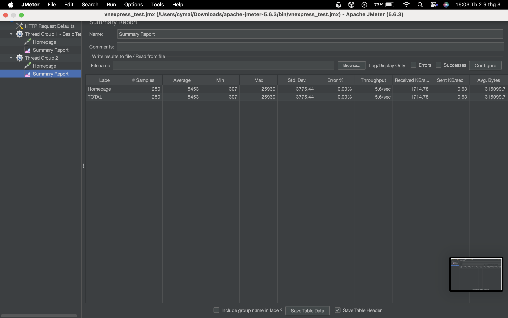
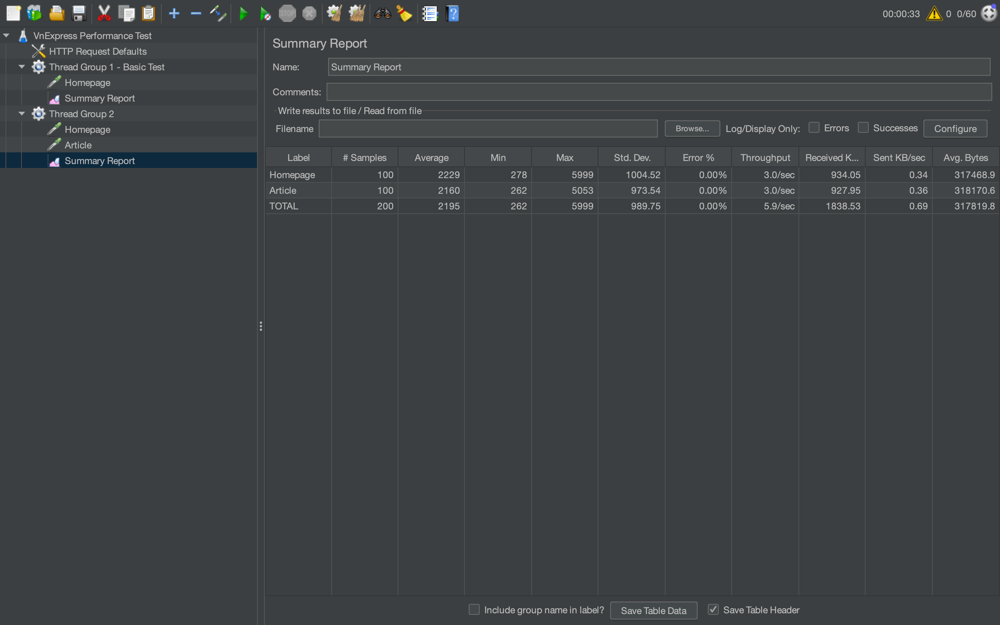
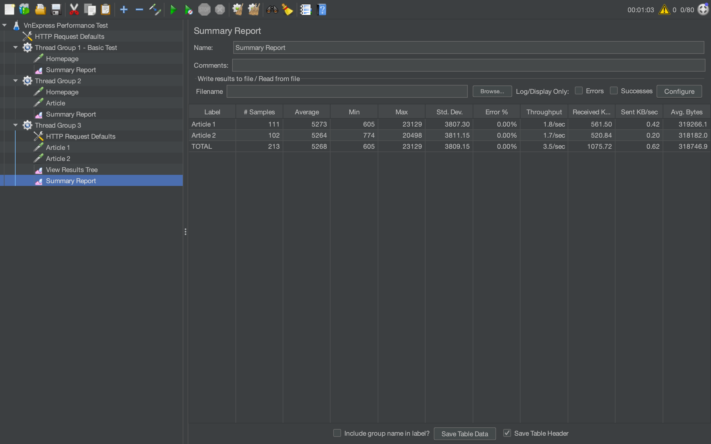

# Kiểm thử hiệu năng website bằng Apache JMeter

## 1. Giới thiệu

Bài thực hành này thực hiện kiểm thử hiệu năng cho website:

https://vnexpress.net

Mục đích là mô phỏng nhiều người dùng truy cập website cùng lúc để quan sát khả năng xử lý của hệ thống. Việc kiểm thử được thực hiện bằng công cụ Apache JMeter với các kịch bản tải khác nhau.

---

# 2. Công cụ sử dụng

Apache JMeter

JMeter là công cụ mã nguồn mở thường được dùng để kiểm thử hiệu năng website. Công cụ này cho phép mô phỏng nhiều người dùng gửi request đến server trong cùng một thời điểm và thu thập các chỉ số như thời gian phản hồi, throughput và tỉ lệ lỗi.

---

# 3. Kịch bản kiểm thử

Trong bài này thực hiện 3 kịch bản kiểm thử khác nhau.

---

# 3.1 Thread Group 1 – Basic Test

Cấu hình:

- Number of Users: 10
- Loop Count: 5
- Request: HTTP GET trang chủ

Kết quả:

Kết quả Summary Report:

- Tổng số request: 250
- Average response time: 5453 ms
- Min: 307 ms
- Max: 25930 ms
- Throughput: 5.6 request/giây
- Error rate: 0%

Nhận xét:

Với số lượng người dùng nhỏ, hệ thống xử lý toàn bộ request thành công và không xuất hiện lỗi. Thời gian phản hồi trung bình khoảng hơn 5 giây, cho thấy website vẫn hoạt động ổn định trong điều kiện tải thấp.

---

# 3.2 Thread Group 2 – Heavy Load Test

Cấu hình:

- Number of Users: 50
- Ramp-up Period: 30 giây
- Các request:
  - Trang chủ
  - Trang bài viết

Kết quả:

Kết quả Summary Report:

Homepage  
- Samples: 100  
- Average: 2229 ms  

Article  
- Samples: 100  
- Average: 2160 ms  

TOTAL  
- Tổng request: 200  
- Average response time: 2195 ms  
- Throughput: 5.9 request/giây  
- Error rate: 0%

Nhận xét:

Ở kịch bản này số lượng người dùng tăng lên 50. Hệ thống vẫn xử lý được toàn bộ request mà không xảy ra lỗi. Thời gian phản hồi trung bình khoảng 2 giây, cho thấy website có khả năng xử lý khá tốt khi lượng truy cập tăng.

---

# 3.3 Thread Group 3 – Custom Scenario

Cấu hình:

- Number of Users: 20
- Thời gian chạy: 60 giây
- Các request:
  - Article 1
  - Article 2

Kết quả:

Kết quả Summary Report:

Article 1  
- Samples: 111  
- Average: 5273 ms  

Article 2  
- Samples: 102  
- Average: 5264 ms  

TOTAL  
- Tổng request: 213  
- Average response time: 5268 ms  
- Throughput: 3.5 request/giây  
- Error rate: 0%

Nhận xét:

Trong 60 giây chạy test, hệ thống xử lý hơn 200 request liên tục từ người dùng. Tất cả request đều thành công và không xuất hiện lỗi. Thời gian phản hồi trung bình khoảng 5 giây khi có nhiều request liên tục được gửi đến server.

---

# 4. Các chỉ số được theo dõi

Trong quá trình kiểm thử, một số chỉ số quan trọng được theo dõi:

- Response Time: thời gian server phản hồi request
- Throughput: số lượng request được xử lý mỗi giây
- Error Rate: tỉ lệ request lỗi
- Number of Samples: tổng số request được gửi

Các chỉ số này giúp đánh giá khả năng chịu tải và độ ổn định của hệ thống.

---

# 5. Kết luận

Sau khi thực hiện các kịch bản kiểm thử bằng Apache JMeter, có thể thấy website vnexpress.net vẫn hoạt động ổn định dưới các mức tải khác nhau.

Trong tất cả các kịch bản kiểm thử, hệ thống đều xử lý thành công toàn bộ request và không xuất hiện lỗi. Khi số lượng người dùng tăng lên hoặc khi chạy test liên tục trong một khoảng thời gian, thời gian phản hồi có tăng nhưng vẫn ở mức chấp nhận được.

Nhìn chung website có khả năng xử lý tương đối tốt khi có nhiều người dùng truy cập đồng thời.

---

# 6. Repository

Toàn bộ file test plan, screenshot và video demo được lưu trong repository GitHub của bài:

https://github.com/cymaii/jmeter-testing
